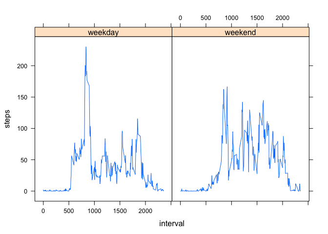

# Reproducible Research: Peer Assessment 1


## Loading and preprocessing the data
1. Load the data

```r
activity <- read.csv("activity.csv")
str(activity)
```

```
## 'data.frame':	17568 obs. of  3 variables:
##  $ steps   : int  NA NA NA NA NA NA NA NA NA NA ...
##  $ date    : Factor w/ 61 levels "2012-10-01","2012-10-02",..: 1 1 1 1 1 1 1 1 1 1 ...
##  $ interval: int  0 5 10 15 20 25 30 35 40 45 ...
```
2. Process/transform the data (if necessary) into a format suitable for your analysis

```r
activity$date <- as.Date(activity$date)
```

## What is mean total number of steps taken per day?
1. Calculate the total number of steps taken per day

```r
totalSteps <- aggregate(steps ~ date, data = activity, FUN = sum)
head(totalSteps)
```

```
##         date steps
## 1 2012-10-02   126
## 2 2012-10-03 11352
## 3 2012-10-04 12116
## 4 2012-10-05 13294
## 5 2012-10-06 15420
## 6 2012-10-07 11015
```
2. Make a histogram of the total number of steps taken each day

```r
hist(totalSteps$steps, main = "Total steps taken per day", xlab = "Number of steps")
```


3. Calculate and report the mean and median of the total number of steps taken per day

```r
mean(totalSteps$steps)
```

```
## [1] 10766.19
```

```r
median(totalSteps$steps) 
```

```
## [1] 10765
```
The **mean** of the total number of steps taken per day is 1.0766189\times 10^{4}  
The **median** of the total number of steps taken per day is 10765

## What is the average daily activity pattern?
1. Make a time series plot (i.e. tpye = "l") of the 5-minute interval (x-axis) and the average number of steps taken, averaged across all days (y-axis)  

```r
stepsByInterval <- aggregate(steps ~ interval, data = activity, FUN = mean)
with(stepsByInterval, plot(interval, steps, type = "l"))
```


  
2. Which 5-minute interval, on average across all the days in the dataset, contains the maximum number of steps?

```r
stepsByInterval$interval[which.max(stepsByInterval$steps)]
```

```
## [1] 835
```
## Imputing missing values
1. Calculate and report the total number of missing values in the dataset (i.e. the total number of rows with NAs)

```r
sum(is.na(activity$steps))
```

```
## [1] 2304
```

```r
sum(is.na(activity$interval))
```

```
## [1] 0
```

```r
sum(is.na(activity$date))
```

```
## [1] 0
```
Total 2304 rows of data are missing.

2. Create a new dataset that is equal to the original dataset but with the missing data filled in.

```r
# Make a copy of original data
activityFilled <- activity

# Fill in the mean for that 5-minute interval
i = 1
for (i in 1:length(activityFilled$steps)) {
    if(is.na(activityFilled$steps[i])) {
        activityFilled$steps[i] <- stepsByInterval[stepsByInterval == activityFilled$interval[i], ]$steps
    }
    i <- i + 1
}
```
3. Make a histogram of the total number of steps taken each day and Calculate and report the mean and median total number of steps taken per day

```r
totalStepsFilled <- aggregate(steps ~ date, data = activityFilled, FUN = sum)
hist(totalStepsFilled$steps, 
     main = "Total steps taken per day with NAs filled", 
     xlab = "Number of steps")
```


```r
mean(totalStepsFilled$steps)
```

```
## [1] 10766.19
```

```r
median(totalStepsFilled$steps)
```

```
## [1] 10766.19
```
The **mean** is 1.0766189\times 10^{4}, stay the same.  
The **median** is 1.0766189\times 10^{4}, slightly different than before.

## Are there differences in activity patterns between weekdays and weekends?
1. Create a new factor variable in the dataset with two levels – “weekday” and “weekend” indicating whether a given date is a weekday or weekend day.

```r
activityFilled$day <- ifelse(weekdays(activityFilled$date) %in% c("Saturday", "Sunday"),
                             "weekend",
                             "weekday")
activityFilled$day <- as.factor(activityFilled$day)
```
2. Make a panel plot containing a time series plot (i.e. type = "l") of the 5-minute interval (x-axis) and the average number of steps taken, averaged across all weekday days or weekend days (y-axis). 

```r
stepsByIntervalFilled <- aggregate(steps ~ interval + day, 
                                   data = activityFilled,
                                   FUN = mean)
library(lattice)
xyplot(steps ~ interval | day, stepsByIntervalFilled, type = "l")
```


